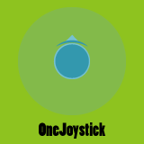
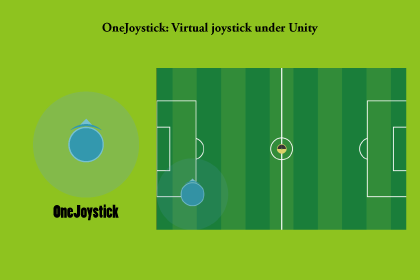
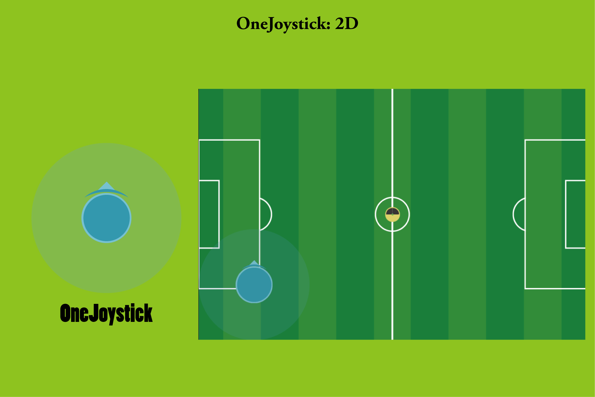
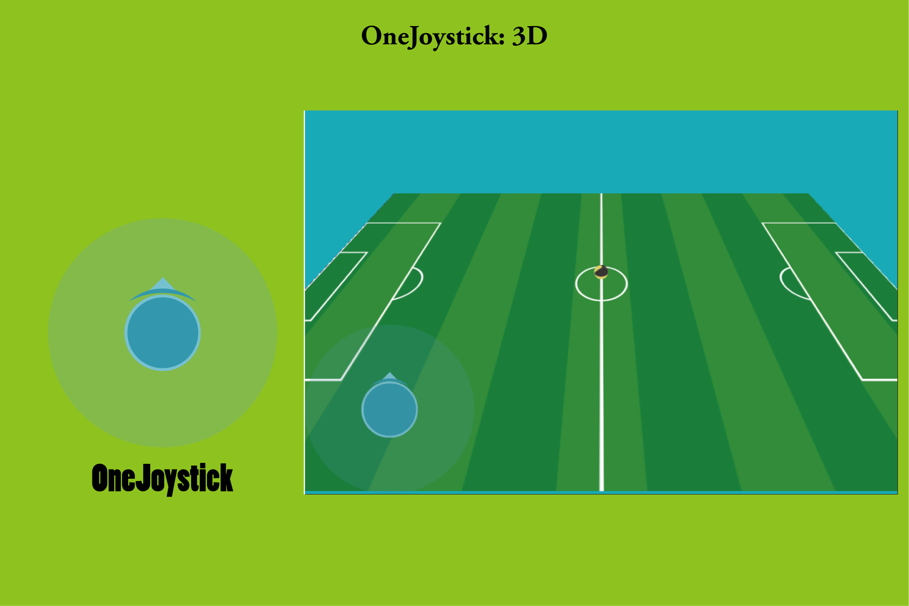
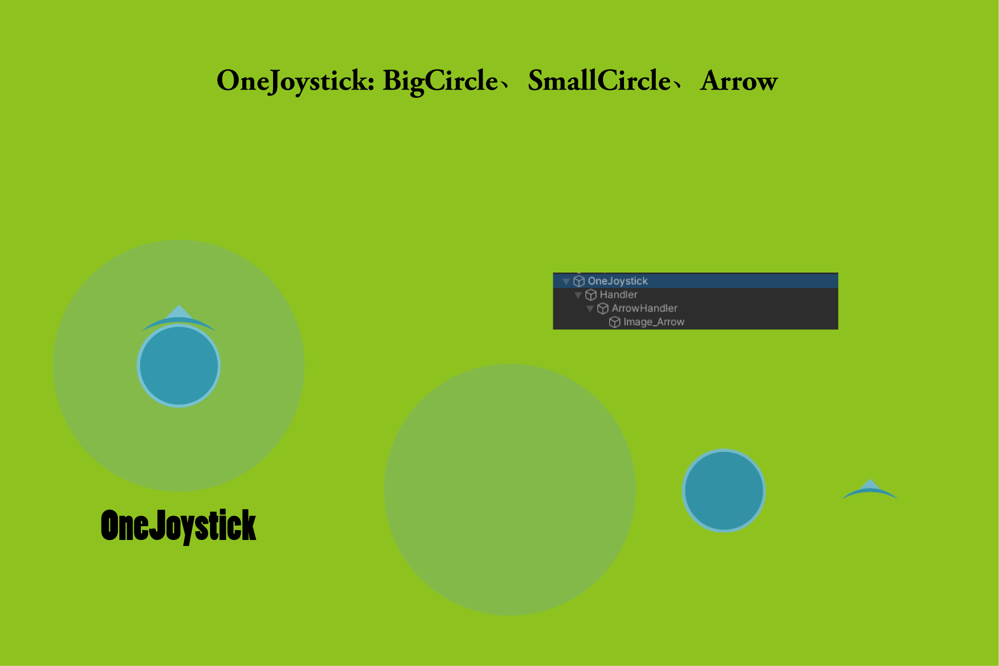
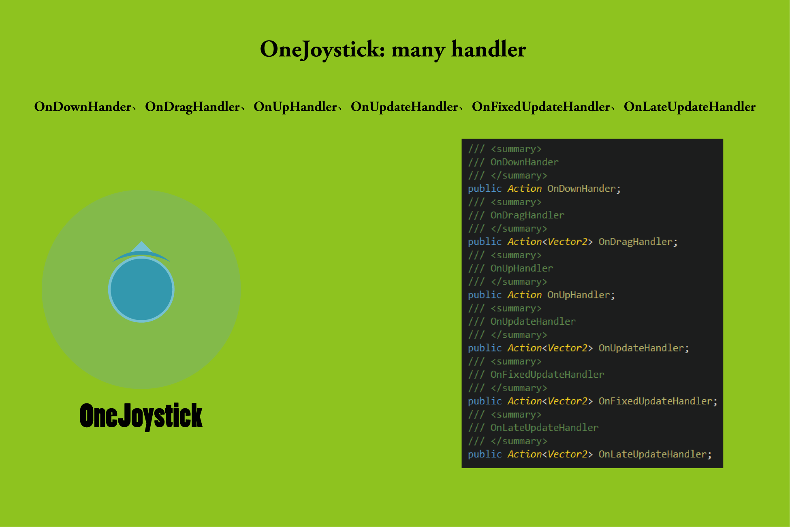
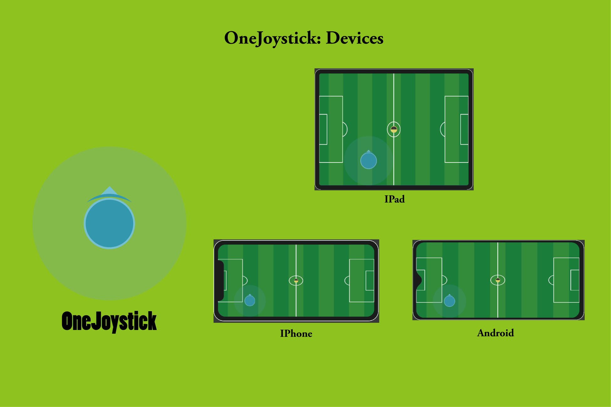
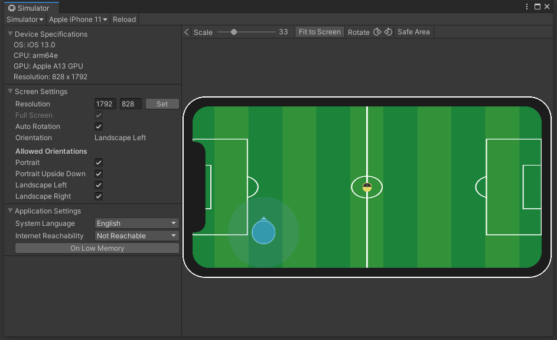

## 

[OneJoystick]( https://assetstore.unity.com/packages/slug/189556 
) OneJoystick is a simple, easy to use and highly customizable virtual joystick.

## Features

- Use cases of built in rem ote sensing in 2D and 3D scenes .
- Support drag callback settings under Drag, Update, LateUpdate.
- The code is concise: it can be highly customized.
- Support remote sensing arrow follow display.
- A script file contains all functions. 

## Function Capture

## Simulator

## Documents

[PDF](./Doc/README.pdf)

## Release Note

### 1.0.1

Init release 

## Contact

For more detail you can go to the web:   https://assetstore.unity.com/packages/slug/189556 

Email: [936496193@qq.com](mailto:936496193@qq.com)
