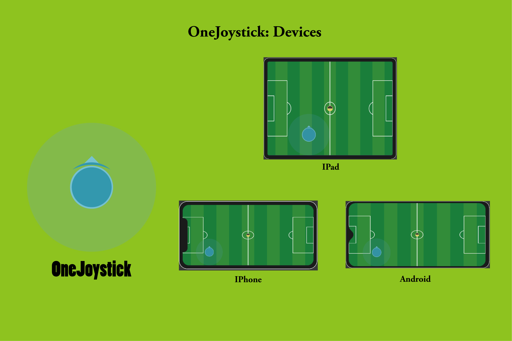

## 

[OneJoystick]( https://assetstore.unity.com/packages/slug/189556 
) 是一个简单易用可以高度定制化的游戏虚拟摇杆。

## 特点

- 内置遥感在2D和3D场景下的使用案例。
- 支持Drag，Update，LateUpdate下的拖动回调的设置。
- 代码简洁：可以高度定制化。
- 支持遥感箭头的跟随显示。
- 一个脚本文件包含了所有功能。

## 功能截图

## 模拟器

## 文档

[PDF](./Doc/README.pdf)

## Release Note

### 1.0.1

Init release 

## 联系

更多信息，请看网站:  https://assetstore.unity.com/packages/slug/189556 

Email: [936496193@qq.com](mailto:936496193@qq.com)
