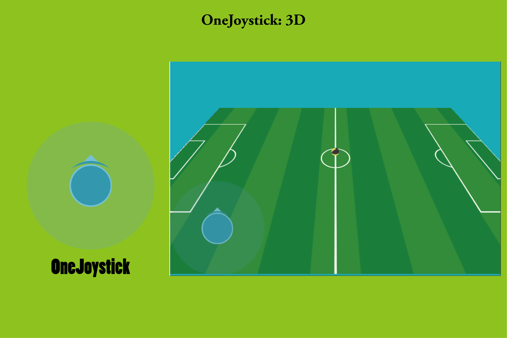
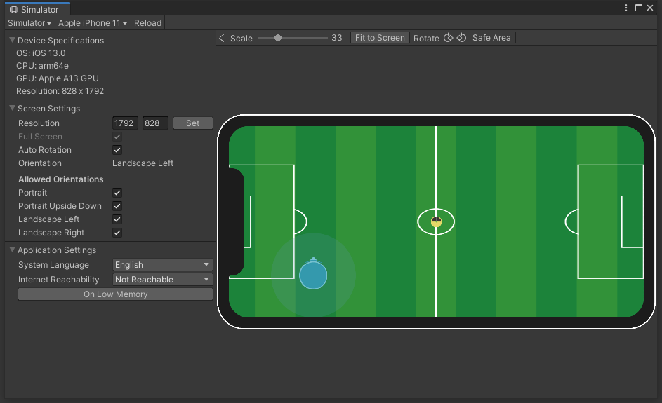

## 

通过摇杆的输入来控制玩家的移动是常见的游戏控制方案。目前市面上的遥感方案缺少具体的示例，有些方案功能又过于复杂。OneJoystick是一个相对来说轻量的遥感解决方案。它不需要特别设置Transform的pivot锚点，全部都是（0.5，0.5）的中心点对齐方式。适配Pc、Android、IOS等多个平台。整个插件需要的图片资源就是大圆、小圆、箭头三个图片。

简单来说[OneJoystick]( https://assetstore.unity.com/packages/slug/189556 
) 是一个简单易用可以高度定制化的游戏虚拟摇杆。

## 特点

- 内置遥感在2D和3D场景下的使用案例。

- 支持Drag，Update，FixUpdate，LateUpdate下的拖动回调的设置。

- 代码简洁：可以高度定制化。

- 支持遥感箭头的跟随显示。

- 一个脚本文件包含了所有功能。

  

## 回调函数

- OnDownHandler：当鼠标按下的时候触发。

- OnUpHandler：当鼠标抬起的时候触发。

- OnDragHandler：当鼠标拖拽的时候触发。

- OnUpdateHandler：当鼠标被按下的时候在Update函数里面一直触发。 

- OnFixedUpdateHandler：当鼠标被按下的时候在FixUpdate函数里面一直触发。 

- OnLateUpdateHandler：当鼠标被按下的时候在LateUpdate函数里面一直触发。 

## 功能截图

## 模拟器

## 文档

[PDF](./Doc/README.pdf)

## Release Note

### 1.0.1

Init release 

## 联系

更多信息，请看网站:  https://assetstore.unity.com/packages/slug/189556 

Email: [936496193@qq.com](mailto:936496193@qq.com)
